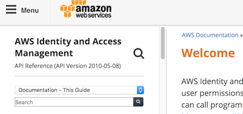
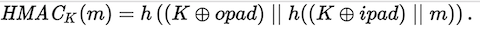

# AWS API リクエストへの署名

## 第30回シェル芸勉強会 大阪サテライトLT
## 2017/8/26
## so

>>>

- [スライド](https://horo17.github.io/signing-aws-api-requests/)

>>>

## `$ whoami`


* so ([@3socha](https://twitter.com/3socha))
* インフラエンジニア (AWS)

---

## AWS API リクエスト

- AWS CLI、各種 SDK は全て REST API を叩いている
- API の仕様は公開されているので自分でクライアントを書くこともできる
- リクエストに Access Key と Secret Access Key 署名する必要がある
    - 署名バージョン4: AWS4-HMAC-SHA256
    - 署名のテストスイートも公開されている

---

## 今日の課題

- AWS API の署名プロセスをシェル芸で追いかける

>>>

## AWS CLI / SDK を使えばいいのでは...?

>>>

## CLI / SDK に存在しない API がある

- Amazon RDS (Relational Database Service) / [DownloadCompleteDBLogFile](http://docs.aws.amazon.com/ja_jp/AmazonRDS/latest/UserGuide/RESTReference.html)

> 特定のシナリオでは、標準の API 構文を使用できない場合があります。
> DownloadCompleteDBLogFile アクションは、ログファイルを取得するために使用できる REST API アクションです。
> データベースログファイルは任意的に大きくなることがあるので、ログファイルの内容のストリーミングを有効にするための DownloadCompleteDBLogFile REST API が提供されます。

>>>

- RDS がインスタンスローカルにファイルとして出力するログをダウンロードする
    - スロークエリログ / 一般ログ / 監査ログ / エラーログなど
- CLI / SDK で用意されているのは `download-db-log-file-portion` のみ
    - 分割ダウンロードされる
- 自分で叩くしかない
- 良い機会なので AWS API 署名のプロセスを知る

---

## シナリオ

- 公式ドキュメントに従ってサンプルのリクエストを生成
- 叩く API は AWS IAM (Identity and Access Management) / `ListUsers`
- リージョンはバージニア北部 (`us-east-1`)
- Access Key : `AKIDEXAMPLE`
- Secret Access Key : `wJalrXUtnFEMI/K7MDENG+bPxRfiCYEXAMPLEKEY`
- リクエスト時刻 : `2015/8/30 12:36:00 UTC`
  - 時刻がかわると、時刻を利用しているハッシュ値が変わるため、このスライドでの `date` は固定の時刻を返すものとして扱う

```
$ date -d '2015/8/30 12:36' --utc +%Y%m%dT%H%M%SZ
20150830T123600Z
```

>>>

## AWS API の署名手順

1. 署名バージョン 4 の正規リクエスト (Canonical Request) を作成
2. 署名バージョン 4 の署名文字列を作成
3. AWS 署名バージョン 4 の署名を計算
4. 署名情報をリクエストに追加

---

## 1. 署名バージョン 4 の正規リクエストを作成

### 正規リクエストの構造

```
CanonicalRequest =
  HTTPRequestMethod + '\n' +
  CanonicalURI + '\n' +
  CanonicalQueryString + '\n' +
  CanonicalHeaders + '\n' +
  SignedHeaders + '\n' +
  HexEncode(Hash(RequestPayload))
```

>>>

## `HTTPRequestMethod`

```
GET
```

- POST も可
- GET でリソースの変更もできるため、RESTful ではない

>>>

## `CanonicalURI`

```
/
```

- URI エンコードする

>>>

## `CanonicalQueryString`

```
Action=ListUsers&Version=2010-05-08
```

- パラメーター名を文字コードポイントで昇順にソート
- URI エンコードする
- Version : AWS API のバージョン
    - 

>>>

## `CanonicalHeaders`

- Content-Type: `application/x-www-form-urlencoded; charset=utf-8`
- Host: `${Service}.${Region}.amazonaws.com`
    - Service : `iam`
    - Region : バージニア北部 (`us-east-1`) の場合は省略可
- X-Amz-Date : `YYYYMMDD'T'HHMMSS'Z'` (ISO8601 基本形式　/ UTC)
- ヘッダ名は小文字に変換
- ヘッダ名を文字コードポイント順で昇順にソート
- 先頭と末尾のスペースを削除
- 連続するスペースは単一のスペースにまとめる

```sh
$ echo -en 'content-type:application/x-www-form-urlencoded; charset=utf-8\nhost:iam.amazonaws.com\nx-amz-date:$(date --utc +%Y%m%dT%H%M%SZ)\n'
content-type:application/x-www-form-urlencoded; charset=utf-8
host:iam.amazonaws.com
x-amz-date:20150830T123600Z`

```

>>> 

## `SignedHeaders`

- `CanonicalHeaders` に含めたヘッダのリスト
- 署名プロセスに使用したヘッダが、プロキシなどで削除されないよう通知
- ヘッダ名を小文字に変換
- ヘッダ名を文字コードポイント順で昇順にソート
- セミコロンで結合

```
content-type;host;x-amz-date
```

>>>

## `HexEncode(Hash(RequestPayload))`

- リクエストペイロード (POST データ) を SHA-256 でハッシュ
- GET の場合はペイロードがないので空文字のハッシュを生成

```sh
$ echo -n | sha256sum | cut -d' ' -f1
e3b0c44298fc1c149afbf4c8996fb92427ae41e4649b934ca495991b7852b855
```

>>>

## 最終的な正規リクエスト

```
echo -ne "GET\n/\nAction=ListUsers&Version=2010-05-08\ncontent-type:application/x-www-form-urlencoded; charset=utf-8\nhost:iam.amazonaws.com\nx-amz-date:$(date --utc +%Y%m%dT%H%M%SZ)\n\ncontent-type;host;x-amz-date\n$(echo -n | sha256sum | cut -d' ' -f1)"
GET
/
Action=ListUsers&Version=2010-05-08
content-type:application/x-www-form-urlencoded; charset=utf-8
host:iam.amazonaws.com
x-amz-date:20150830T123600Z

content-type;host;x-amz-date
e3b0c44298fc1c149afbf4c8996fb92427ae41e4649b934ca495991b7852b855
```

>>>

## 正規リクエストのダイジェスト

- SHA-256 でハッシュ

```
echo -ne "GET\n/\nAction=ListUsers&Version=2010-05-08\ncontent-type:application/x-www-form-urlencoded; charset=utf-8\nhost:iam.amazonaws.com\nx-amz-date:$(date --utc +%Y%m%dT%H%M%SZ)\n\ncontent-type;host;x-amz-date\n$(echo -n | sha256sum | cut -d' ' -f1)" |\
sha256sum | cut -d' ' -f1)
f536975d06c0309214f805bb90ccff089219ecd68b2577efef23edd43b7e1a59
```

---

## 2. 署名バージョン 4 の署名文字列を作成
### 署名文字列の構造

```
StringToSign =
    Algorithm + \n +
    RequestDateTime + \n +
    CredentialScope + \n +
    HashedCanonicalRequest
```

>>>

## `Algorithm`

```
AWS4-HMAC-SHA256
```

>>>

## `RequestDateTime`

```sh
date --utc +%Y%m%dT%H%M%SZ
```

- ただしここでは `20150830T123600Z`

>>>

## `CredentialScope`

- 日付 / リージョン / サービス / 終了文字列 (`aws4_request`) を `/` で結合
- 日付は YYYYMMDD 形式
    - ただしここでは `20150830`

```sh
$ echo -n "$(date --utc +%F | tr -d '-')/us-east-1/iam/aws4_request"
20150830/us-east-1/iam/aws4_request
```

>>>

## `HashedCanonicalRequest`

- 前手順で作成した正規リクエストのダイジェスト

```
f536975d06c0309214f805bb90ccff089219ecd68b2577efef23edd43b7e1a59
```

>>>

## 最終的な署名文字列

```
StringToSign =
    Algorithm + \n +
    RequestDateTime + \n +
    CredentialScope + \n +
    HashedCanonicalRequest
```

```sh
$ echo -en "AWS4-HMAC-SHA256\n$(date --utc +%Y%m%dT%H%M%SZ)\n$(date --utc +%F | tr -d '-')/us-east-1/iam/aws4_request\n$(echo -ne "GET\n/\nAction=ListUsers&Version=2010-05-08\ncontent-type:application/x-www-form-urlencoded; charset=utf-8\nhost:iam.amazonaws.com\nx-amz-date:$(date --utc +%Y%m%dT%H%M%SZ)\n\ncontent-type;host;x-amz-date\n$(echo -n | sha256sum | cut -d' ' -f1)" | sha256sum | cut -d' ' -f1)"
AWS4-HMAC-SHA256
20150830T123600Z
20150830/us-east-1/iam/aws4_request
f536975d06c0309214f805bb90ccff089219ecd68b2577efef23edd43b7e1a59
```

---

## 3. AWS 署名バージョン 4 の署名を計算

- 署名アルゴリズム : AWS4-HMAC-SHA256
- HMAC
  - Hash-based Message Authentication Code
      - 認証、改竄検出に使われるメッセージ認証符号
  - 秘密鍵、メッセージ、ハッシュ関数を利用して計算
  - 
- SHA256:
  - ハッシュ関数
  - 繰り返しハッシュを求めることができる

>>>

## HMAC-SHA256 を計算

- openssl を利用
- [PRF Test Vectors](https://tools.ietf.org/html/rfc4868#section-2.7.1) の実行例
    - 参考: [OpenSSL HMACコマンドの使い方（dgst -hmacの引数がひどい件）](http://eng-notebook.com/blog-entry-107/)

```
$ echo -n 'what do ya want for nothing?' | openssl dgst -hmac Jefe -sha256
(stdin)= 5bdcc146bf60754e6a042426089575c75a003f089d2739839dec58b964ec3843
```

>>>

## 署名キーを取得

```
kSecret = SecretAccessKey
kDate = HMAC("AWS4" + kSecret, Date)
kRegion = HMAC(kDate, Region)
kService = HMAC(kRegion, Service)
kSigning = HMAC(kService, "aws4_request")
```

- HMAC-SHA256 を繰り返し計算する必要がある
- 秘密鍵を binary ではなく hex で入力するためにすこしオプションを変更

```
$ openssl dgst -mac HMAC -macopt hexkey:$kDate -sha256
``` 

>>>

```
kSecret = SecretAccessKey
kDate = HMAC("AWS4" + kSecret, Date)
kRegion = HMAC(kDate, Region)
kService = HMAC(kRegion, Service)
kSigning = HMAC(kService, "aws4_request")
```

```sh
$ aws_secret_access_key=wJalrXUtnFEMI/K7MDENG+bPxRfiCYEXAMPLEKEY; \
  echo -n aws4_request | openssl dgst -mac HMAC -macopt hexkey:$(
    echo -n iam | openssl dgst -mac HMAC -macopt hexkey:$(
      echo -n us-east-1 | openssl dgst -mac HMAC -macopt hexkey:$(
        echo -n $(date --utc +%F | tr -d '-') | openssl dgst -hmac "AWS4$aws_secret_access_key" -sha256 | cut -d' ' -f2
      ) -sha256 | cut -d' ' -f2
    ) -sha256 | cut -d' ' -f2
  ) -sha256 | cut -d' ' -f2
c4afb1cc5771d871763a393e44b703571b55cc28424d1a5e86da6ed3c154a4b9
```

>>>

## 署名

```
signature = HexEncode(HMAC(derived signing key, string to sign))
```

- 署名キーを取得する時と同じ

```sh
$ echo -en "AWS4-HMAC-SHA256\n$(date --utc +%Y%m%dT%H%M%SZ)\n$(date --utc +%F | tr -d '-')/us-east-1/iam/aws4_request\n$(echo -ne "GET\n/\nAction=ListUsers&Version=2010-05-08\ncontent-type:application/x-www-form-urlencoded; charset=utf-8\nhost:iam.amazonaws.com\nx-amz-date:$(date --utc +%Y%m%dT%H%M%SZ)\n\ncontent-type;host;x-amz-date\n$(echo -n | sha256sum | cut -d' ' -f1)" | sha256sum | cut -d' ' -f1)" | openssl dgst -mac HMAC -macopt hexkey:$(
  echo -n aws4_request | openssl dgst -mac HMAC -macopt hexkey:$(
    echo -n iam | openssl dgst -mac HMAC -macopt hexkey:$(
      echo -n us-east-1 | openssl dgst -mac HMAC -macopt hexkey:$(
        echo -n $(date --utc +%F | tr -d '-') | openssl dgst -hmac "AWS4$aws_secret_access_key" -sha256 | cut -d' ' -f2
      ) -sha256 | cut -d' ' -f2
    ) -sha256 | cut -d' ' -f2
  ) -sha256 | cut -d' ' -f2
) -sha256 | cut -d' ' -f2
5d672d79c15b13162d9279b0855cfba6789a8edb4c82c400e06b5924a6f2b5d7
```

---

## 4. 署名情報をリクエストに追加する

- Authorization ヘッダーに署名情報を追加する
- (またはクエリ文字列に署名情報を追加する)

```
Authorization: algorithm Credential=access key ID/credential scope, SignedHeaders=SignedHeaders, Signature=signature
```

```sh
$ echo "AWS4-HMAC-SHA256 Credential=AKIDEXAMPLE/$(date --utc +%F | tr -d '-')/us-east-1/iam/aws4_request, SignedHeaders=content-type;host;x-amz-date, Signature=$(
  echo -en "AWS4-HMAC-SHA256\n$(date --utc +%Y%m%dT%H%M%SZ)\n$(date --utc +%F | tr -d '-')/us-east-1/iam/aws4_request\n$(echo -ne "GET\n/\nAction=ListUsers&Version=2010-05-08\ncontent-type:application/x-www-form-urlencoded; charset=utf-8\nhost:iam.amazonaws.com\nx-amz-date:$(date --utc +%Y%m%dT%H%M%SZ)\n\ncontent-type;host;x-amz-date\n$(echo -n | sha256sum | cut -d' ' -f1)" | sha256sum | cut -d' ' -f1)" | openssl dgst -mac HMAC -macopt hexkey:$(
    echo -n aws4_request | openssl dgst -mac HMAC -macopt hexkey:$(
      echo -n iam | openssl dgst -mac HMAC -macopt hexkey:$(
        echo -n us-east-1 | openssl dgst -mac HMAC -macopt hexkey:$(
          echo -n $(date --utc +%F | tr -d '-') | openssl dgst -hmac "AWS4$aws_secret_access_key" -sha256 | cut -d' ' -f2
        ) -sha256 | cut -d' ' -f2
      ) -sha256 | cut -d' ' -f2
    ) -sha256 | cut -d' ' -f2
  ) -sha256 | cut -d' ' -f2
)"
AWS4-HMAC-SHA256 Credential=AKIDEXAMPLE/20150830/us-east-1/iam/aws4_request, SignedHeaders=content-type;host;x-amz-date, Signature=5d672d79c15b13162d9279b0855cfba6789a8edb4c82c400e06b5924a6f2b5d7
```

>>>

## `curl` で殴る

```sh
$ curl -s "https://ami.amazonaws.com/?Action=ListUsers&Version=2010-05-08" \
  -H "Content-Type: application/x-www-form-urlencoded; charset=utf-8" \
  -H "X-Amz-Date: $(date --utc +%Y%m%dT%H%M%SZ)" \
  -H "Authorization: $(
    echo "AWS4-HMAC-SHA256 Credential=AKIDEXAMPLE/$(
      date --utc +%F | tr -d '-'
    )/us-east-1/iam/aws4_request, SignedHeaders=content-type;host;x-amz-date, Signature=$(
      echo -en "AWS4-HMAC-SHA256\n$(
        date --utc +%Y%m%dT%H%M%SZ
      )\n$(
        date --utc +%F | tr -d '-'
      )/us-east-1/iam/aws4_request\n$(
        echo -ne "GET\n/\nAction=ListUsers&Version=2010-05-08\ncontent-type:application/x-www-form-urlencoded; charset=utf-8\nhost:iam.amazonaws.com\nx-amz-date:$(
            date --utc +%Y%m%dT%H%M%SZ
          )\n\ncontent-type;host;x-amz-date\n$(
            echo -n | sha256sum | cut -d' ' -f1
          )" | sha256sum | cut -d' ' -f1
        )" | openssl dgst -mac HMAC -macopt hexkey:$(
          echo -n aws4_request | openssl dgst -mac HMAC -macopt hexkey:$(
            echo -n iam | openssl dgst -mac HMAC -macopt hexkey:$(
              echo -n us-east-1 | openssl dgst -mac HMAC -macopt hexkey:$(
                echo -n $(
                  date --utc +%F | tr -d '-'
                ) | openssl dgst -hmac "AWS4$aws_secret_access_key" -sha256 | cut -d' ' -f2
              ) -sha256 | cut -d' ' -f2
            ) -sha256 | cut -d' ' -f2
          ) -sha256 | cut -d' ' -f2
        ) -sha256 | cut -d' ' -f2
      )
    )"
```

---

## まとめ

- シェル芸でも AWS API リクエストに署名してアクセスできる
- AWS v4 署名プロセスに使われている手段がなんとなくわかった
  - AWS 側では、この署名の検証をおこなっている
- Web API でもリクエスト再送攻撃から保護するための仕組みがなんとなくわかった

>>>

## 良くないところ

- `date` を複数回呼んでるので、実行中に秒が変わると認証エラーになるかも
